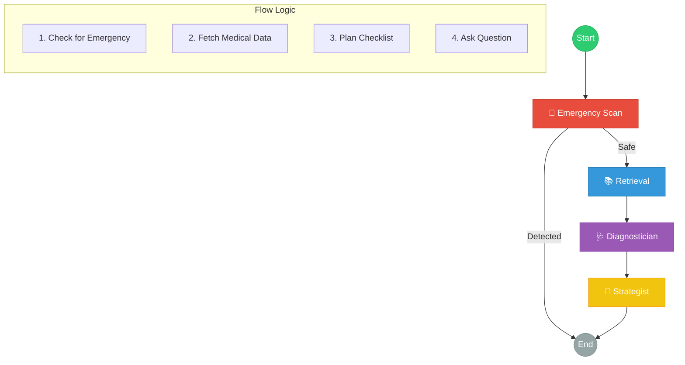

```mermaid
graph TD
    %% Define Nodes with Styles
    Start((Start))
    EmergencyScan[🚨 Emergency Scan]
    Retrieval[📚 Retrieval]
    Diagnostician[🩺 Diagnostician]
    Strategist[🎯 Strategist]
    End((End))

    %% Styles
    style Start fill:#2ecc71,stroke:#27ae60,color:white
    style EmergencyScan fill:#e74c3c,stroke:#c0392b,color:white
    style Retrieval fill:#3498db,stroke:#2980b9,color:white
    style Diagnostician fill:#9b59b6,stroke:#8e44ad,color:white
    style Strategist fill:#f1c40f,stroke:#f39c12,color:white
    style End fill:#95a5a6,stroke:#7f8c8d,color:white

    %% Graph Connections
    Start --> EmergencyScan
    
    %% Conditional Edge from Emergency Scan
    EmergencyScan -- "Detected" --> End
    EmergencyScan -- "Safe" --> Retrieval
    
    %% Linear Flow
    Retrieval --> Diagnostician
    Diagnostician --> Strategist
    Strategist --> End

    %% Explanations
    subgraph Flow Logic
        direction TB
        L1[1. Check for Emergency]
        L2[2. Fetch Medical Data]
        L3[3. Plan Checklist]
        L4[4. Ask Question]
    end
```
